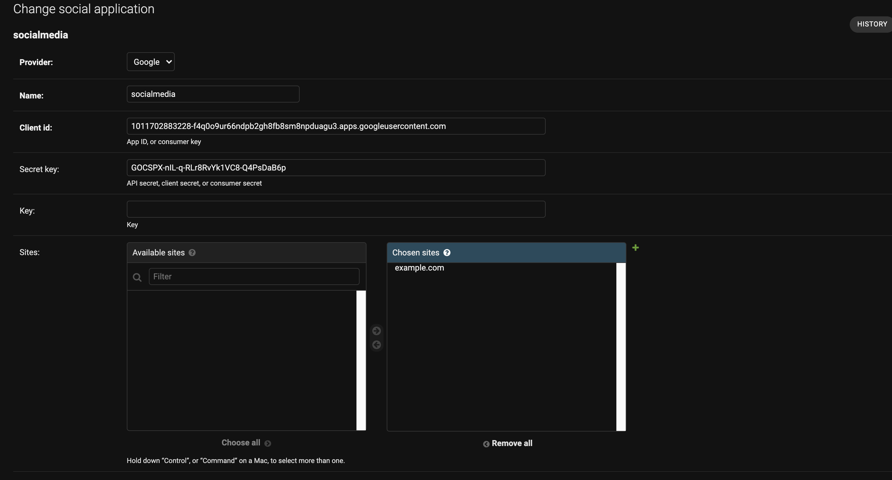
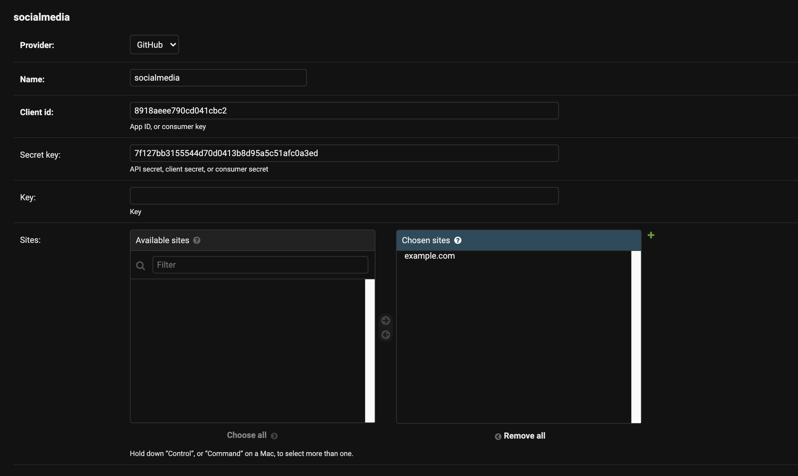

# f21_team_1
Repository for f21_team_1

## How to run
Besides,
`pip install django-allauth`

`pip install social-auth-app-django`

`pip install python-social-auth`
(these 3 maybe needed)

To support rich text editor
`pip install django-ckeditor`

To support news feed
`pip install newsapi-python`

To support geolocation
`pip install geopy`

## How to setup Allauth

When you makemigrations and migrate

1. Create a super account
    `python manage.py createsuperuser`

2. Login as super user
    http://127.0.0.1/admin
    
3. Delete all the posts, profiles and users (except the super user!!!)
   
4. Click "Social applications"
   
5. Click "ADD SOCIAL APPLICATION"
   
6. Fill the form as the following 

   

    The Client id is : 1011702883228-f4q0o9ur66ndpb2gh8fb8sm8npduagu3.apps.googleusercontent.com
    
    The Secret key is : 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

7. Click SAVE, this is done for Google OAuth

8. Click "ADD SOCIAL APPLICATION"

9. Fill the form as the following 

    The Client id is : 8918aeee790cd041cbc2
    
    The Secret key is : 7f127bb3155544d70d0413b8d95a5c51afc0a3ed

10. Click SAVE, this is done for GitHub OAuth